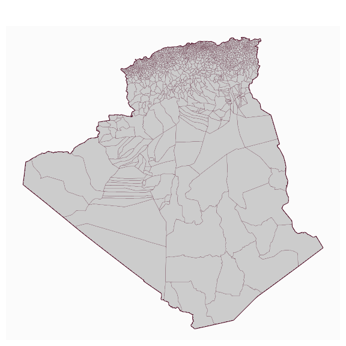
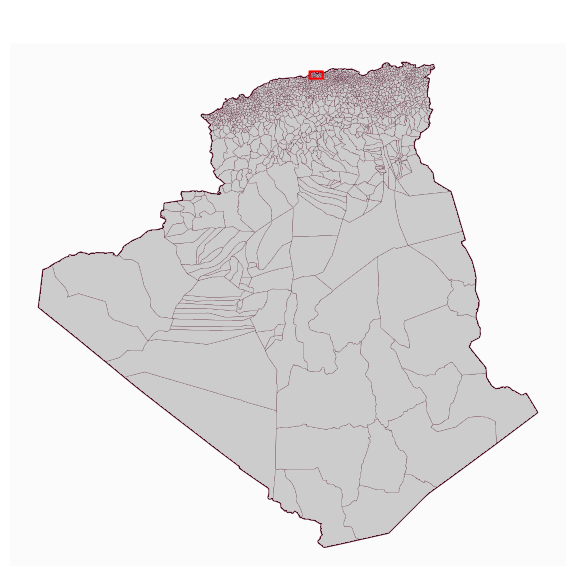
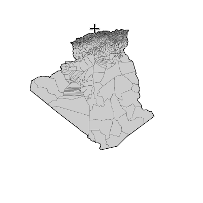
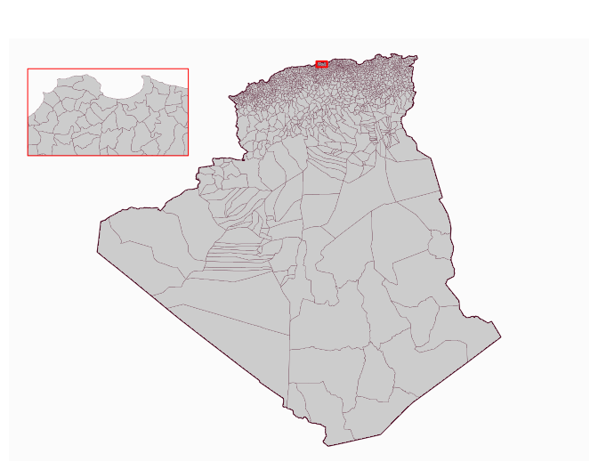
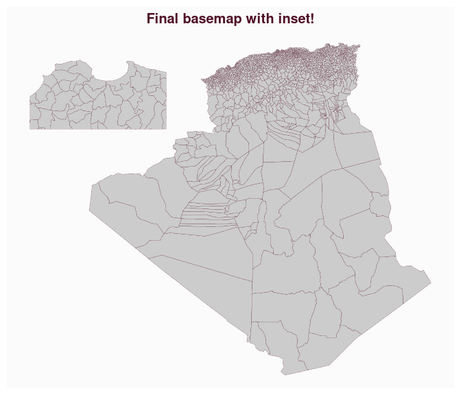
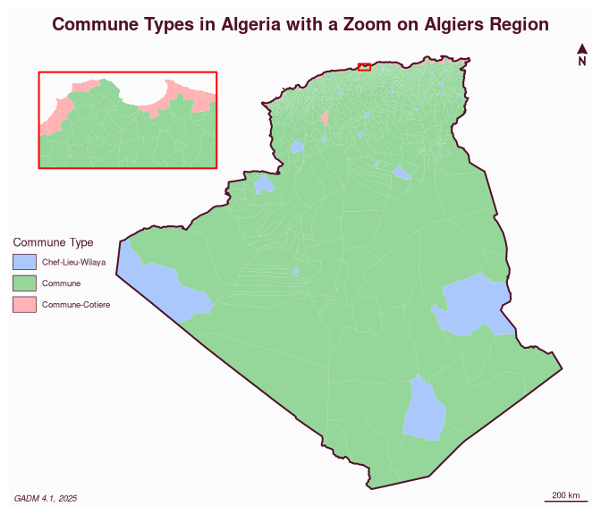

# Create Map Insets with `mapinsetr`

[](https://riatelab.r-universe.dev/mapinsetr)

Map insets are small zoom-in or zoom-out maps that focus on particular
territories within a general map. `mapinsetr` provides a set of
functions that helps to create such insets.

## Installation

You can install `mapinsetr` from the r-universe.

``` r
install.packages("mapinsetr", repos = "https://riatelab.r-universe.dev")
```

## Example

The aim of this example is to create a base map of Algeria’s
municipalities with an inset on the Algiers wilaya.  
Here are the few steps of the base map creation process:

- download data on Algerian administrative boundaries,  
- create a mask that will help to extract the municipalities,  
- create an inset of Algiers municipalities within the previously
  created mask,  
- merge the original basemap and inset

### Download data on Algerian administrative boundaries.

The `geodata` package offers an access to the [GADM
database](http://www.gadm.org/) through the `gadm()` function. The ISO3
code of Algeria is **DZA** and we will need 2 levels of administrative
data (**0** for the state and **2** for the municipalities).  
Basemaps (`SpatVector`, `terra` objects) are downloaded unprojected in
WGS84. We have to transform them into simple feature collections (`sf`
objects) and project them in a valid projection (the EPSG code 30791
stands for “Nord Sahara 1959 / Voirol Unifie Nord”).

``` r
library(geodata)
#> Loading required package: terra
#> terra 1.8.29
library(sf)
#> Linking to GEOS 3.13.1, GDAL 3.10.2, PROJ 9.5.1; sf_use_s2() is TRUE
library(mapsf)
# download data from gadm.org
adm0 <- st_as_sf(gadm(country = "DZA", level = 0, path = tempdir()))
adm0 <- st_transform(adm0, "EPSG:30791")
adm2 <- st_as_sf(gadm(country = "DZA", level = 2, path = tempdir()))
adm2 <- st_transform(adm2, "EPSG:30791")
# plot
mf_map(adm0, lwd = 2)
mf_map(adm2, add = TRUE, col = "grey80", lwd = 0.2)
```

<!-- -->

### Create a mask that will help to extract the municipalities

Our goal is to extract Alger municipalities. To extract those
municipalities we will use a mask.  
This mask has to be an `sf` object. The `create_mask` function create a
mask based on a `bbox`, an `sf` or `sfc` extent or an interactively
defined rectangle.  
In this example we use a mask defined by Algiers wilaya extent + a 2 km
buffer.

``` r
library(mapinsetr)
alger_extent <- st_buffer(adm2[adm2$NAME_1=="Alger", ],dist = 2000)
box_alger <- create_mask(bb = alger_extent)
mf_map(adm0, lwd = 2)
mf_map(adm2, add = TRUE, col = "grey80", lwd = 0.2)
mf_map(box_alger, border = "red", col = NA, add = TRUE, lwd = 2)
```

<!-- -->

Alternatively, one can define the mask interactively on the plot :

``` r
library(mapinsetr)
mf_map(adm0, lwd = 2)
mf_map(adm2, add = TRUE, col = "grey80", lwd = 0.2)
box_alger_interactive <- create_mask(interactive = TRUE, add=TRUE, 
                                     prj =  st_crs(adm0))
```



### Create an inset of Alger municipalities within the previously created mask

The `move_and_resize` function extracts polygons or multipolygons (`x`)
within a mask (`mask`), moves them to coordinates (`xy`, bottom left
corner of the inset) and resizes them according to a factor (`k`).

``` r
zoom_alger <- move_and_resize(x = adm2, mask = box_alger, xy = c(-1000000,  -100000), k = 15)
box <- move_and_resize(x = box_alger, mask = box_alger, xy = c(-1000000,  -100000), k = 15)
mf_map(adm0, lwd = 2)
mf_map(adm2, add = TRUE, col = "grey80", lwd = 0.2)
mf_map(box_alger, border = "red", col = NA, add = TRUE, lwd = 2)
mf_map(zoom_alger, add = TRUE, col = "grey80", lwd = 0.2)
mf_map(box, border = "red", col = NA, lwd = 1, add = TRUE)
```

<!-- -->

### Merge the original basemap and inset

We currently have 2 `sf` objects, the next step is to merge them in a
single one. `inset_rbinder` merge the initial basemap and the inset.

``` r
adm2final <- inset_rbinder(list(adm2, zoom_alger))
mf_map(adm2final, col = "grey80", lwd = 0.2)
mf_title("Final basemap with inset!")
```

<!-- -->

### Plot an example

The following example build a map of Municipalities types.

``` r
library(mapsf)
mf_map(adm2final, var = "TYPE_2", type = "typo", 
       leg_title  = "Commune Type", border = "white", 
       lwd = 0.1, pal = "Set 3",
       leg_pos = "left")
mf_map(adm0, lwd = 2, add = TRUE, col = NA)
mf_map(box_alger, border = "red", col = NA, add = TRUE, lwd = 2)
mf_map(box, border = "red", col = NA, lwd = 2, add = TRUE)
mf_title("Commune Types in Algeria with a Zoom on Algiers Region")
mf_credits("GADM 4.1, 2025")
mf_scale(200)
mf_arrow(pos = "topright")
```

<!-- -->
