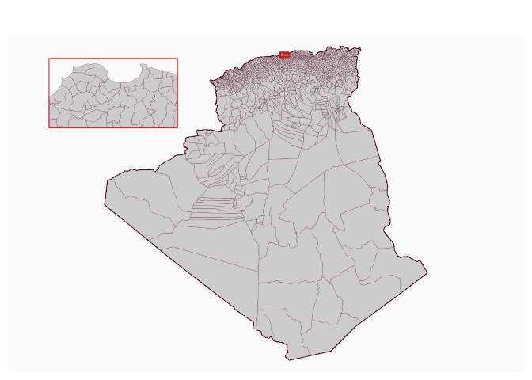
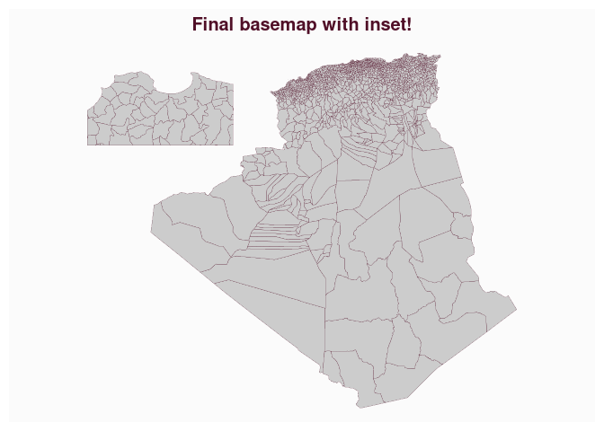

# Create Map Insets with `mapinsetr`


[](https://travis-ci.org/riatelab/mapinsetr)

Map insets are small zoom-in or zoom-out maps that focus on particular
territories within a general map. `mapinsetr` provides a set of
functions that helps to create such insets.

## Installation

``` r
require(devtools)
devtools::install_github("riatelab/mapinsetr")
```

## Version

The [previous
version](https://github.com/riatelab/mapinsetr/releases/tag/v0.1.0) of
the package was based on `sp`, `rgeos` and `maptools`.  
This version (0.2.0) is based on the [`sf`
package](https://github.com/r-spatial/sf) only.

## Example

The aim of this example is to create a base map of Algeria’s
municipalities with an inset on the Algiers wilaya.  
Here are the few steps of the base map creation process:

-   download data on Algerian administrative boundaries,  
-   create a mask that will help to extract the municipalities,  
-   create an inset of Alger municipalities within the previously
    created mask,  
-   merge the original basemap and inset

### Download data on Algerian administrative boundaries.

The `raster` package offers an access to the [GADM
database](http://www.gadm.org/) through the `getData()` function. The
ISO3 code of Algeria is **DZA** and we will need 2 levels of
administrative data (**0** for the state and **2** for the
municipalities).  
Basemaps (`SpatialPolygonsDataFrame`) are downloaded unprojected in
WGS84. We have to transform them into simple feature collections (`sf`
objects) and project them in a valid projection (the EPSG code 30791
stands for “Nord Sahara 1959 / Voirol Unifie Nord”).

``` r
library(raster)
library(sf)
# download data from gadm.org
adm0 <-st_as_sf( getData(name = "GADM", country = "DZA", level = 0, path = tempdir() ))
adm0 <- st_transform(adm0, 30791)
adm2 <- st_as_sf(getData(name = "GADM", country = "DZA", level = 2, path = tempdir()))
adm2 <- st_transform(adm2, 30791)
# plot
plot(st_geometry(adm0), lwd = 2)
plot(st_geometry(adm2), add = T, col = "grey80", lwd = 0.2)
```

<!-- -->

### Create a mask that will help to extract the municipalities

Our goal is to extract Alger municipalities. To extract those
munuicipalities we will use a mask.  
This mask has to be an sf object. The `create_mask` function create a
mask based on a bbox, a sf or sfc extent or an interactively defined
rectangle.  
In this example we use a mask defined by Alger willaya extent + a 2 km
buffer.

``` r
library(mapinsetr)
alger_extent <- st_buffer(adm2[adm2$NAME_1=="Alger", ],dist = 2000)
box_alger <- create_mask(bb = alger_extent)
plot(st_geometry(adm0), lwd = 2)
plot(st_geometry(adm2), add=T, col = "grey80", lwd = 0.2)
plot(st_geometry(box_alger), border = "red", add=T, lwd = 2)
```

<!-- -->

Alternatively, one can define the mask interactively on the plot :

``` r
library(mapinsetr)
plot(st_geometry(adm0), lwd = 2)
plot(st_geometry(adm2), add=T, col = "grey80", lwd = 0.2)
box_alger_interactive <- create_mask(interactive = TRUE, add=TRUE, 
                                     prj =  st_crs(adm0))
```


### Create an inset of Alger municipalities within the previously created mask

The `move_and_resize` function extracts polygons or multipolygons (`x`)
within a mask (`mask`), moves them to coordinates (`xy`, bottom left
corner of the inset) and resizes them according to a factor (`k`).

``` r
zoom_alger <- move_and_resize(x = adm2, mask = box_alger, xy = c(-1000000,  -100000), k = 15)
box <- move_and_resize(x = box_alger, mask = box_alger, xy = c(-1000000,  -100000), k = 15)
plot(st_geometry(adm0), lwd = 2)
plot(st_geometry(adm2), add=T, col = "grey80", lwd = 0.2)
plot(st_geometry(box_alger), border = "red", add=T, lwd = 2)
plot(st_geometry(zoom_alger), add=T, col = "grey80", lwd = 0.2)
plot(st_geometry(box), border = "red", lwd = 1, add=T)
```

<!-- -->

### Merge the original basemap and inset

We currently have 2 sf objects, the next step is to merge them in a
single one `inset_rbinder` merge the initial basemap and the inset.

``` r
adm2final <- inset_rbinder(list(adm2, zoom_alger))
plot(st_geometry(adm2final), col = "grey80", lwd = 0.2)
title("Final basemap with inset!")
```

<!-- -->

### Plot an example

The following example build a map of Municipalities types.

``` r
library(cartography)
adm2final[adm2final$CCA_2==2223, "TYPE_2"] <- "Commune"
plot(st_geometry(adm0), lwd = 2)
typoLayer(adm2final, var = "TYPE_2", 
          legend.title.txt = "Commune Type",
          border = "white", lwd = 0.1, 
          col = carto.pal("multi.pal", 3), 
          legend.pos = "topright", add = T)
plot(st_geometry(box_alger), border = "red", add=T, lwd = 2)
plot(st_geometry(box), border = "red", lwd = 2, add=T)
layoutLayer(title = "Commune Types in Algeria with a Zoom on Alger Region", 
            sources = "GADM 2.8, 2015", author = "@rCarto", theme = "green.pal")
```

<!-- -->
