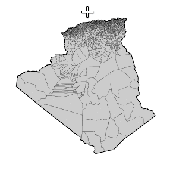

```{r setup, include=FALSE}
knitr::opts_chunk$set(echo = TRUE)
```

```{r knitr_init, echo=FALSE, cache=FALSE}
library(knitr)
## Global options
options(max.print="75")
opts_chunk$set(echo=TRUE,
	             cache=FALSE,
               prompt=FALSE,
               tidy=TRUE,
               comment=NA,
               message=FALSE,
               warning=FALSE, 
               fig.width=7)
opts_knit$set(width=75)

knit_hooks$set(par = function(before, options, envir){
if (before){
  par(mar=c(0,0,0,0))
  } 
})

knit_hooks$set(par.title = function(before, options, envir){
if (before){
  par(mar=c(0,0,1.2,0))
  } 
})
```

# Create Map Insets with `mapinsetr`

 [](https://travis-ci.org/riatelab/mapinsetr)

Map insets are small zoom-in or zoom-out maps that focus on particular territories within a general map. `mapinsetr` provides a set of function that help to create such insets.  
  
## Installation
```{r, eval=FALSE}
require(devtools)
devtools::install_github("riatelab/mapinsetr")
```


## Version 
This is version 0.1.0, function names and arguments may change...

## Example

The aim of this example is to create a base map of Algeria's municipalities with an inset on the Algiers wilaya.   
Here are the few steps of the base map creation process:  

- download data on Algerian administrative boundaries,   
- create a mask that will help to extract the municipalities,   
- create an inset of Alger municipalities within the previously created mask,    
- merge the original basemap and inset


### Download data on Algerian administrative boundaries.

The `raster` package offers an access to the [GADM database](http://www.gadm.org/) through the `getData()` function. 
The ISO3 code of Algeria is **DZA** and we will need 2 levels of administrative data (**0** for the state and **2** for the municipalities).   
Boundaries (`SpatialPolygonsDataFrame`) are downloaded unprojected in WGS84, so we have to transform them in a valid projection (EPSG:30791 stands for "Nord Sahara 1959 / Voirol Unifie Nord").   

```{r dowload, par=TRUE}
library(raster)
# download data from gadm.org
adm0 <- getData(name = "GADM", country="DZA", level=0, path = tempdir())
adm0 <- spTransform(adm0, "+init=epsg:30791")
adm2 <- getData(name = "GADM", country="DZA", level=2, path = tempdir())
adm2 <- spTransform(adm2, "+init=epsg:30791")
# plot
plot(adm0, lwd = 2)
plot(adm2, add=T, col = "grey80", lwd = 0.2)

```

### Create a mask that will help to extract the municipalities
Our goal is to extract Alger municipalities. To extract those munuicipalities we will use a mask.   
This mask has to be a SpatialPolygonDataFrame. The `create_mask` function create a mask based on a bbox, a SpatialPolygonsDataFrame extent or a interactively defined rectangle.  
In this example we use a mask defined by Alger willaya extent + a 2 km buffer. 

```{r mask, par = TRUE}
library(mapinsetr)
alger_extent <- rgeos::gBuffer(adm2[adm2$NAME_1=="Alger", ], width = 2000)
box_alger <- create_mask(bb = alger_extent, prj = adm2@proj4string)
plot(adm0, lwd = 2)
plot(adm2, add=T, col = "grey80", lwd = 0.2)
plot(box_alger, border = "red", add=T, lwd = 2)
```


Alternatively, one can define the mask interactively on the plot :
```{r mask2, eval=FALSE}
library(mapinsetr)
plot(adm0, lwd = 2)
plot(adm2, add=T, col = "grey80", lwd = 0.2)
box_alger_interactive <- create_mask(interactive = TRUE, add=TRUE, 
                                     prj = adm2@proj4string)
```




### Create an inset of Alger municipalities within the previously created mask

The `move_and_resize` function extracts `SpatialPolygonsDataFrame` (`spdf`) within a mask (`mask`), move them to coordinates (`xy`, bottom left corner of the inset) and resize them according to a factor (`k`). 

```{r createInset, par = TRUE}
zoom_alger <- move_and_resize(spdf = adm2, mask = box_alger, xy = c(-1000000,  -100000), k = 15)
box <- move_and_resize(spdf = box_alger, mask = box_alger, xy = c(-1000000,  -100000), k = 15)
plot(adm0, lwd = 2)
plot(adm2, add=T, col = "grey80", lwd = 0.2)
plot(box_alger, border = "red", add=T, lwd = 2)
plot(zoom_alger, add=T, col = "grey80", lwd = 0.2)
plot(box, border = "red", lwd = 1, add=T)
```


### Merge the original basemap and inset
We currently have 2 `SpatialPolygonsDataFrame`, the next step is to merge them in a single object. 
`inset_rbinder` merge the initial basemap and inset. 

```{r mergespdf, par.title = TRUE}

adm2final <- inset_rbinder(list(adm2, zoom_alger))
plot(adm2final, col = "grey80", lwd = 0.2)
title("Final basemap with inset!")

```

### Plot an example
This simple example creates a map of Municipalities types. 

```{r ex, par.title = TRUE}

library(cartography)
adm2final[adm2final$CCA_2==2223, "TYPE_2"] <- "Commune"
plot(adm0, lwd = 2)
typoLayer(adm2final, var = "TYPE_2", 
          legend.title.txt = "Commune Type",
          border = "white", lwd = 0.1, 
          col = carto.pal("multi.pal", 3), 
          legend.pos = "topright", add = T)
plot(box_alger, border = "red", add=T, lwd = 2)
plot(box, border = "red", lwd = 2, add=T)
layoutLayer(title = "Commune Types in Algeria with a Zoom on Alger Region", 
            sources = "GADM 2.8, 2015", author = "rCarto", theme = "green.pal")

```

