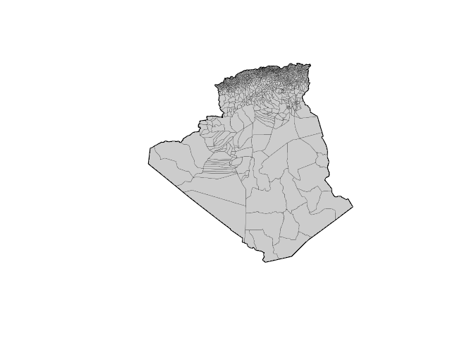
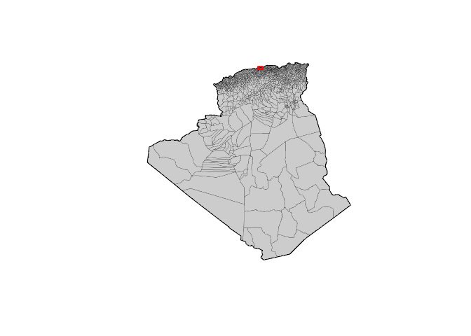
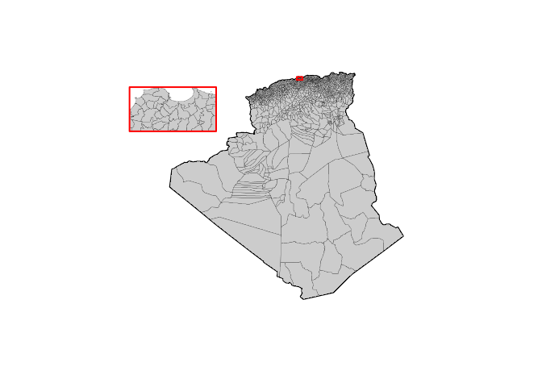
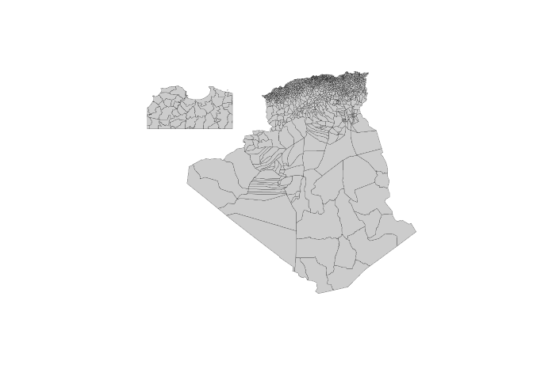

Download administrative boundaries of Algeria from the GADM thanks to raster::getData.
--------------------------------------------------------------------------------------

``` r
library(raster)
```

    ## Loading required package: sp

``` r
## Download data from gadm.org
adm0 <- getData(name = "GADM", country="DZA", level=0, path = tempdir())
adm0 <- spTransform(adm0, "+init=epsg:30791")
adm2 <- getData(name = "GADM", country="DZA", level=2, path = tempdir())
adm2 <- spTransform(adm2, "+init=epsg:30791")

plot(adm0, lwd = 2)
plot(adm2, add=T, col = "grey80", lwd = 0.2)
```



Create a mask en Alger region
-----------------------------

``` r
library(mapinsetr)
box_alger <- create_mask(bb = adm2[adm2$NAME_1=="Alger", ], 
                         prj = adm2@proj4string)
plot(adm0, lwd = 2)
plot(adm2, add=T, col = "grey80", lwd = 0.2)
plot(box_alger, border = "red", add=T, lwd = 2)
```



Use that mask to extract regions and create an inset
----------------------------------------------------

``` r
zoom_alger <- move_and_resize(spdf = adm2, mask = box_alger, xy = c(-1000000,  -100000), k = 15)
box <- move_and_resize(spdf = box_alger, mask = box_alger, xy = c(-1000000,  -100000), k = 15)

plot(adm0, lwd = 2)
plot(adm2, add=T, col = "grey80", lwd = 0.2)
plot(box_alger, border = "red", add=T, lwd = 2)
plot(zoom_alger, add=T, col = "grey80", lwd = 0.2)
plot(box, border = "red", lwd = 2, add=T)
```



Merge the original basemap and inset
------------------------------------

``` r
adm2final <- inset_rbinder(list(adm2, zoom_alger))

plot(adm2final, col = "grey80", lwd = 0.2)
```



Plot an example
---------------

``` r
library(cartography)
adm2final[adm2final$CCA_2==2223, "TYPE_2"] <- "Commune"
par(mar = c(0,0,1.2,0))
plot(adm0, lwd = 2)
typoLayer(adm2final, var = "TYPE_2", legend.title.txt = "Commune Type",
          border = "white", lwd = 0.1, 
          col = carto.pal("multi.pal", 3), 
          legend.pos = "topright", add = T)
plot(box_alger, border = "red", add=T, lwd = 2)
plot(box, border = "red", lwd = 2, add=T)

layoutLayer(title = "Commune Types in Algeria with a Zoom on Alger Region", 
            sources = "GADM 2.8, 2015", author = "rCarto", theme = "green.pal")
```


